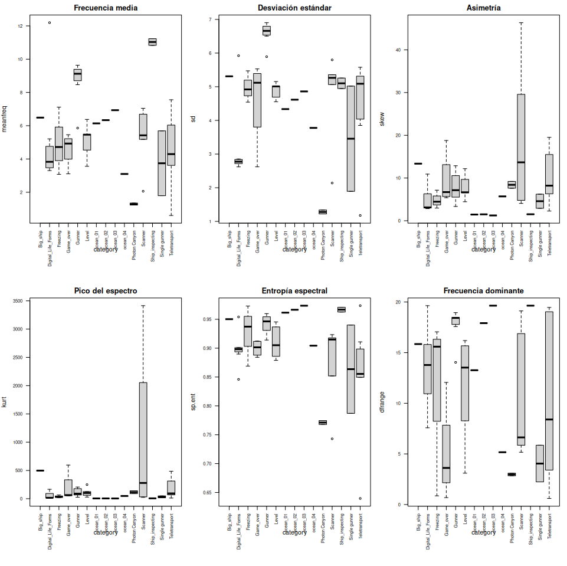
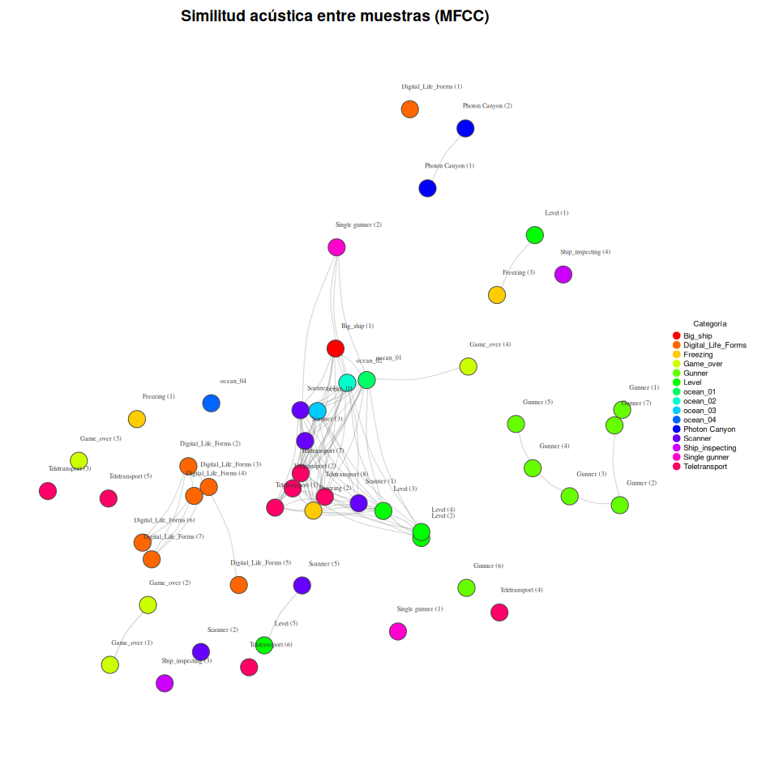

# Clasificación frecuencial de muestras de audio mediante MDS

## Descripción del proyecto

En el campo audiovisual existe un perfil profesional conocido como [diseñador de sonido](https://www.studiobinder.com/blog/what-does-a-sound-designer-do/). Este profesional se dedica a la creación de efectos sonoros con el objetivo de narrar, personificar, generar emociones, retratar espacios sonoros, épocas y, en definitiva, crear un universo sonoro con una identidad particular dentro del contexto audiovisual en el que trabaja.

El resultado de este trabajo es un proceso metódico y artesanal donde el volumen de archivos de sonido generados puede llegar a ser enorme. Esto puede provocar una pérdida de perspectiva tímbrica en el proceso creativo: cuanto mayor es el volumen de muestras, más fácil es que algunos sonidos terminen siendo similares entre sí, disminuyendo la originalidad del trabajo.

**Una herramienta que analice las muestras desde la perspectiva frecuencial y determine si existe similitud entre ellas es una solución que ahorra tiempo en decisiones de naturaleza creativa.** Permite establecer cuál es la predominancia frecuencial del conjunto y, por tanto, conocer el carácter tímbrico de ese grupo de muestras.

## ¿Qué hace este proyecto?

Analiza un conjunto de archivos de audio WAV (efectos de sonido 8-bit de videojuegos) y visualiza sus relaciones de similitud acústica. El pipeline es:

1. **Extracción de parámetros acústicos** — frecuencia media, desviación estándar, asimetría, curtosis, entropía espectral, rango de frecuencia dominante, etc.
2. **Cross-correlation MFCC** — compara cada par de sonidos mediante coeficientes cepstrales en frecuencia Mel (la misma técnica usada en reconocimiento de voz).
3. **Cálculo de distancias euclidianas** — transforma la matriz de correlación en distancias numéricas.
4. **Multidimensional Scaling (MDS)** — reduce esas distancias a 2 dimensiones para poder visualizarlas.
5. **Visualización** — boxplots por categoría, grafo de similitud y scatter plot MDS.

## Resultados

### Scatter plot MDS


Imagina que cada sonido es una "receta" con muchos ingredientes (frecuencia media, entropía, pico espectral, etc.). Con más de 20 ingredientes, no se pueden visualizar directamente.

**MDS coloca los sonidos en un mapa 2D de forma que los que suenan parecido quedan cerca y los que suenan diferente quedan lejos.**

Es como un mapa de ciudades: no necesitas saber la latitud y longitud exactas, solo que Madrid esté cerca de Toledo y lejos de Tokio. MDS hace lo mismo pero con sonidos.

**Importante:** Los ejes (V1, V2) no representan nada concreto. No es "derecha = agudos" ni "arriba = graves". Son coordenadas abstractas. Si rotaras el gráfico 90°, sería igualmente válido. La información está en las **distancias relativas** entre puntos, no en su posición absoluta.

En este gráfico se observa:
- Los **Gunner** (disparos) se agrupan en la zona inferior izquierda: son variaciones del mismo tipo de sonido.
- Los **Digital_Life_Forms** forman su propio cluster a la derecha, alejados del resto.
- Los **Photon Canyon** están aislados arriba a la derecha: son sonidos únicos en la colección.
- **Level**, **Scanner** y **Teletransport** se mezclan en la zona central-superior, compartiendo características frecuenciales similares.

---

### Boxplots por categoría



Muestran cómo se distribuye cada parámetro acústico dentro de cada categoría de sonido. Permiten:

- **Detectar outliers**: sonidos acústicamente muy diferentes al resto de su grupo.
- **Evaluar la varianza**: si un parámetro tiene poca dispersión, no aporta capacidad discriminante al modelo.
- **Entender el MDS**: las categorías que se parecen en estos parámetros estarán cercanas en el mapa 2D.

Observaciones destacadas:
- **Scanner** tiene la frecuencia media más alta (~11 kHz) y un pico del espectro enorme (~2000): es un sonido agudo con un pico espectral muy marcado.
- **ocean** tiene frecuencia media baja y entropía espectral baja: es un sonido más "plano" y grave.
- **Teletransport** presenta las cajas más anchas en casi todos los parámetros: es la categoría con mayor diversidad acústica interna.

---

### Grafo de similitud acústica



A diferencia del scatter plot, el grafo muestra **explícitamente quién suena parecido a quién**:

- **Nodos** = archivos de sonido, coloreados por categoría.
- **Líneas (edges)** = conexiones entre sonidos con correlación MFCC superior al 75%. Si dos nodos están conectados, suenan parecido.
- **Posición** = determinada por MDS, igual que el scatter.
- **Nodos aislados (sin líneas)** = sonidos acústicamente únicos en la colección.

Observaciones destacadas:
- El **centro** tiene un núcleo muy conectado (Scanner, ocean, Teletransport, Freezing...): son los sonidos más "genéricos" del pack que comparten características frecuenciales.
- Los **Gunner** están agrupados a la derecha pero **sin conexiones con el centro**: suenan parecido entre sí pero son acústicamente distintos al resto.
- **Photon Canyon** está aislado arriba: ambas muestras se conectan entre sí pero con nada más.
- **Digital_Life_Forms (1)** está completamente aislado: es el sonido más diferente de toda la colección.

## Estructura del proyecto

```
Clasificacion-Frecuencial-MDS/
├── Frecuencial_classification.R    # Script principal de análisis
├── README.md
├── .gitignore
├── Clasificación_frecuencial.pdf   # Documento del TFM original
├── category_Boxplots.png           # Boxplots por categoría
├── similitud_muestras.png          # Grafo de similitud acústica
├── Scatter MDS.png                 # Scatter plot MDS
└── TFM_iebs/                       # Proyecto TFM original
    ├── Data/
    │   └── 8bits/                  # 55 archivos WAV (no incluidos, ver instalación)
    └── Script/                     # Scripts y documentación original del TFM
```

## Instalación y ejecución

### Requisitos

- R 4.0 o superior
- Los paquetes listados a continuación

### 1. Instalar dependencias

```r
install.packages(c("tuneR", "seewave", "warbleR", "NatureSounds",
                    "igraph", "cluster", "ggplot2", "ggfortify"))
```

### 2. Preparar los datos

Los archivos WAV no están incluidos en el repositorio por su tamaño. Coloca tus archivos `.wav` en la carpeta `TFM_iebs/Data/8bits/`.

El script espera archivos con el formato `Nombre (número).wav` (por ejemplo: `Gunner (3).wav`, `Teletransport (1).wav`) para poder extraer las categorías automáticamente.

### 3. Ejecutar

Abre R o RStudio con el directorio de trabajo en la raíz del proyecto y ejecuta:

```r
source("Frecuencial_classification.R")
```

## Metodología técnica

### Multidimensional Scaling (MDS)

[MDS](https://ncss-wpengine.netdna-ssl.com/wp-content/themes/ncss/pdf/Procedures/NCSS/Multidimensional_Scaling.pdf) es una técnica que crea un mapa mostrando las posiciones relativas de un conjunto de objetos, dada únicamente una tabla de distancias entre ellos. El programa calcula la solución métrica o no métrica. La tabla de distancias se conoce como matriz de proximidad.

### MFCC (Mel-Frequency Cepstral Coefficients)

Los coeficientes cepstrales en frecuencia Mel son una representación del espectro de potencia a corto plazo de un sonido, basada en una escala que imita la percepción auditiva humana. Se utilizan aquí para calcular la correlación cruzada entre pares de muestras, generando una matriz de similitud.

### Pipeline de análisis

```
WAV files → spectro_analysis() → parámetros acústicos → boxplots
         → cross_correlation() → matriz MFCC → dist() → cmdscale() → scatter MDS
                                             → similitud → grafo igraph
```

## Cambios respecto al proyecto original (TFM 2020)

### Actualización de funciones de warbleR

El paquete `warbleR` renombró varias funciones entre la versión usada en el TFM original (2020) y la versión actual. Los cambios necesarios fueron:

| Original (2020) | Actual | Descripción |
|---|---|---|
| `specan()` | `spectro_analysis()` | Extracción de parámetros acústicos |
| `xcorr()` | `cross_correlation()` | Correlación cruzada tiempo-frecuencia |
| `read_wave()` | `read_sound_file()` | Lectura de archivos de audio |

### Mejoras en la visualización

**Boxplots por categoría en lugar de scatter por índice:**
El script original mostraba los parámetros acústicos como scatter plots donde el eje X era el índice de la muestra (posición arbitraria en la tabla). Esto no aportaba información útil. Los boxplots agrupados por categoría permiten comparar directamente cómo se distribuye cada parámetro entre tipos de sonido.

**Grafo de similitud con conexiones reales:**
El script original usaba `graph.tree()`, que crea una estructura de árbol arbitraria donde las flechas no representan ninguna relación real entre los sonidos. El grafo actual usa `graph_from_adjacency_matrix()` con un umbral de similitud (correlación > 0.75), de modo que las conexiones representan similitud acústica real.

### Limpieza del código

- Eliminadas librerías no utilizadas (`imager`, `knitr`).
- Eliminada la llamada a `install.packages()` dentro del script.
- Eliminados paths hardcodeados; se usa `file.path(getwd(), ...)` para portabilidad.
- Eliminado código duplicado y comentado.
- Reorganizado en secciones numeradas con un flujo lineal claro.
- Añadido `parallel = 4` en la cross-correlation para mejor rendimiento.

## Origen

Este proyecto tiene su origen en el Trabajo de Fin de Máster (TFM) del Máster en Business Intelligence y Data Science de IEBS, titulado *"Machine Learning applied to Sound Design"* (octubre 2020), por Alberto Jiménez Rodríguez.

## Licencia

Este proyecto es de uso educativo y de investigación.
