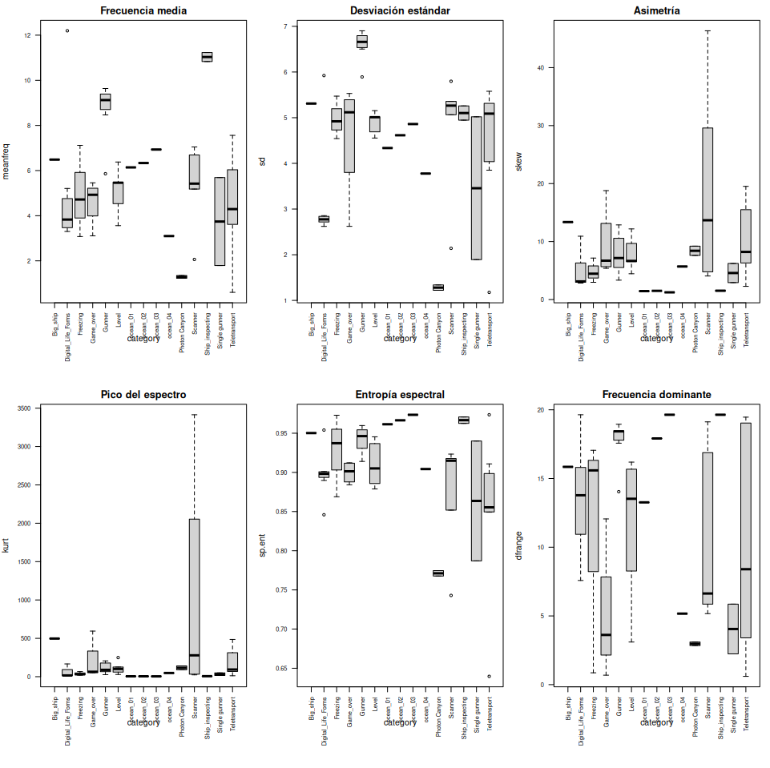
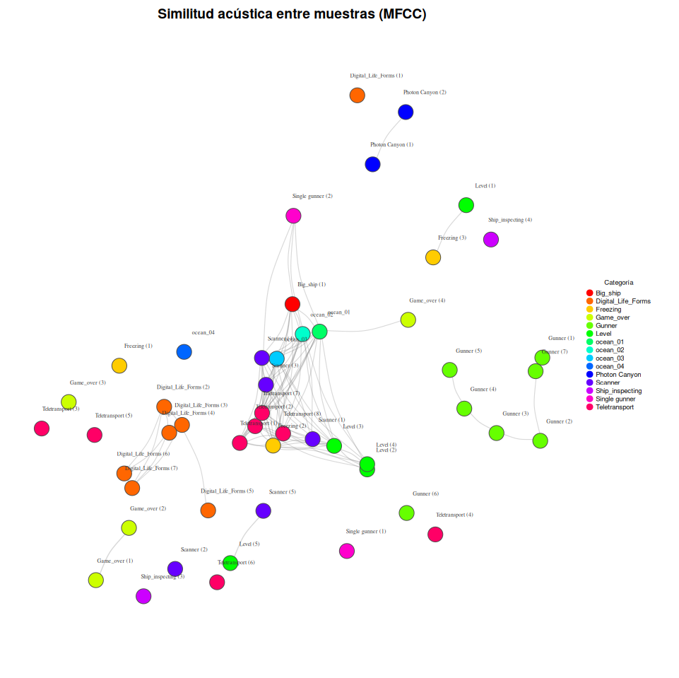

# Frequency Classification of Audio Samples via MDS

[](https://www.r-project.org/)
[](https://cran.r-project.org/package=warbleR)
[](#license)
[](https://accounts.iebschool.com/mi-diploma/abaa0886b52591b851a33c17b4653f20/)

---

## Background

This project is the result of the Master's Thesis (TFM) for the [Master in Business Intelligence and Data Science at IEBS](https://accounts.iebschool.com/mi-diploma/abaa0886b52591b851a33c17b4653f20/) (October 2020), by Alberto Jiménez Rodríguez.

The master's program was focused on business and entrepreneurship. However, rather than working within a domain I had no direct experience in, I chose to apply the concepts learned to a field I know deeply: audio and sound design. The premise was straightforward — if Machine Learning techniques can classify customers, products or market patterns, they can equally classify sound samples based on their frequency properties.

This is not a forced analogy. Dimensionality reduction, distance calculation and similarity visualization are domain-agnostic tools. They work the same way with financial data, genetic data or acoustic data. What changes is the data source and the interpretation of the results, not the methodology.

The outcome is a project that demonstrates the practical application of MDS and MFCC cross-correlation to a real problem in sound design workflows: identifying redundancies and similarity relationships within large audio sample collections.

---

## Project Description

In the audiovisual industry, the [sound designer](https://www.studiobinder.com/blog/what-does-a-sound-designer-do/) is responsible for creating sound effects that narrate, personify, generate emotions, portray sonic spaces, eras, and ultimately build a sound universe with a distinct identity within an audiovisual context.

This work is methodical and artisanal, and the volume of sound files generated for a project can be enormous. This can lead to a loss of timbral perspective in the creative process: the larger the collection, the easier it is for sounds to become similar to each other, diminishing the originality of the work.

**A tool that analyzes samples from a frequency perspective and determines whether similarity exists between them saves time in creative decision-making.** It reveals the frequency predominance of the set and therefore the timbral character of that group of samples.

### Applications Beyond Audio

#### Same clustering approach optimizes social media content mix

The methodology is domain-agnostic. The same pipeline that identifies redundant audio samples — extract parameters, compute similarity, reduce dimensions, visualize clusters — can identify redundant content strategies.

Applied to social media, each post becomes a "sample": instead of mean frequency or spectral entropy, the parameters are engagement rate, reach, content type, posting time, or topic. This MDS algorithm clusters audio samples by frequency similarity. Applied to social media, it clusters posts by performance patterns, identifies content gaps, and optimizes posting mix.

Concretely:

- **Clusters of similar-performing posts** reveal which content types are redundant — the equivalent of sounds that overlap in the center of the similarity graph because they share too many characteristics.
- **Isolated nodes** represent unique content that stands out from the rest. On social media, these are the posts worth doubling down on.
- **Content gaps** appear as empty regions in the MDS scatter plot: areas where no posts currently land, but where the distances suggest there is room for a distinct content type.

The axes remain abstract coordinates, but the relative distances hold the information: two posts that are close on the map share performance characteristics; two that are far apart behave differently with the audience. The tool does not change. The data source does.

---

## What Does This Project Do?

It analyzes a set of WAV audio files (8-bit video game sound effects) and visualizes their acoustic similarity relationships. The pipeline is:

1. **Acoustic parameter extraction** — mean frequency, standard deviation, skewness, kurtosis, spectral entropy, dominant frequency range, etc.
2. **MFCC cross-correlation** — compares each pair of sounds using Mel-Frequency Cepstral Coefficients (the same technique used in speech recognition).
3. **Euclidean distance calculation** — transforms the correlation matrix into numerical distances.
4. **Multidimensional Scaling (MDS)** — reduces those distances to 2 dimensions for visualization.
5. **Visualization** — category boxplots, similarity graph and MDS scatter plot.

---

## Results

> **Dataset:** 55 WAV files, 8-bit video game sound effects, organized into named categories (`Gunner`, `Scanner`, `Teletransport`, `Digital_Life_Forms`, `Photon Canyon`, `ocean`, `Freezing`, `Level`).
> All three visualizations are complementary: the boxplots explain *why* sounds cluster, the scatter plot shows *where* they cluster, and the graph shows *which* specific sounds are connected.

---

### MDS Scatter Plot


> Each point is a sound file. Distance between points = acoustic dissimilarity. Closer = more similar.

Think of each sound as a "recipe" with many ingredients (mean frequency, entropy, spectral peak, etc.). With over 20 ingredients, direct visualization is impossible.

**MDS places sounds on a 2D map so that similar-sounding ones are close together and different-sounding ones are far apart.**

It works like a city map: you don't need exact latitude and longitude, only that Madrid is close to Toledo and far from Tokyo. MDS does the same but with sounds.

**Important:** The axes (V1, V2) have no concrete meaning. It's not "right = high-pitched" or "up = bass". They are abstract coordinates. If you rotated the chart 90 degrees, it would be equally valid. The information lies in the **relative distances** between points, not their absolute position.

**Key observations:**
- **Gunner** samples (gunshot sounds) cluster in the lower left: they are variations of the same type of sound.
- **Digital_Life_Forms** form their own cluster on the right, far from the rest.
- **Photon Canyon** samples are isolated in the upper right: they are unique sounds in the collection.
- **Level**, **Scanner** and **Teletransport** mix in the upper-central area, sharing similar frequency characteristics.

---

### Category Boxplots



> Each panel shows the distribution of one acoustic parameter across all sound categories. These are the raw features that drive the distances in the MDS map.

These show how each acoustic parameter is distributed within each sound category. They allow you to:

- **Detect outliers**: sounds that are acoustically very different from the rest of their group.
- **Evaluate variance**: if a parameter has low dispersion, it provides no discriminant power to the model.
- **Understand the MDS**: categories with similar parameters will be close together on the 2D map.

**Key observations:**
- **Scanner** has the highest mean frequency (~11 kHz) and an enormous spectral peak (~2000): it is a sharp sound with a very pronounced spectral peak.
- **ocean** has low mean frequency and low spectral entropy: it is a "flatter", deeper sound.
- **Teletransport** has the widest boxes across almost all parameters: it is the category with the greatest internal acoustic diversity.

---

### Acoustic Similarity Graph



> Nodes = individual sound files. Edges = MFCC correlation > 75%. If two nodes are connected, they are acoustically similar. Isolated nodes have no equivalent in the collection.

Unlike the scatter plot, the graph explicitly shows **which sounds are similar to which**:

- **Nodes** = sound files, colored by category.
- **Edges** = connections between sounds with MFCC correlation above 75%. If two nodes are connected, they sound alike.
- **Position** = determined by MDS, same as the scatter plot.
- **Isolated nodes (no edges)** = acoustically unique sounds in the collection.

**Key observations:**
- The **center** has a densely connected core (Scanner, ocean, Teletransport, Freezing...): these are the most "generic" sounds in the pack, sharing frequency characteristics.
- **Gunner** samples are grouped on the right but **with no connections to the center**: they sound similar to each other but are acoustically distinct from everything else.
- **Photon Canyon** is isolated at the top: both samples connect to each other but to nothing else.
- **Digital_Life_Forms (1)** is completely isolated: it is the most different sound in the entire collection.

---

## Project Structure

```
Clasificacion-Frecuencial-MDS/
├── Frecuencial_classification.R    # Main analysis script (full pipeline)
├── README.md
├── .gitignore
├── Clasificación_frecuencial.pdf   # Original thesis document (Spanish)
├── category_Boxplots.png           # Output — acoustic parameter boxplots by category
├── similitud_muestras.png          # Output — MFCC similarity graph
├── Scatter MDS.png                 # Output — MDS 2D scatter plot
└── TFM_iebs/                       # Original thesis project (2020)
    ├── Data/
    │   └── 8bits/                  # 55 WAV files (not included, see setup)
    └── Script/                     # Original scripts and documentation
```

---

## Setup and Execution

### Requirements

- R 4.0 or higher
- The packages listed below

### 1. Install dependencies

```r
install.packages(c("tuneR", "seewave", "warbleR", "NatureSounds",
                    "igraph", "cluster", "ggplot2", "ggfortify"))
```

### 2. Prepare the data

WAV files are not included in the repository due to their size. Place your `.wav` files in the `TFM_iebs/Data/8bits/` folder.

The script expects files named as `Name (number).wav` (e.g., `Gunner (3).wav`, `Teletransport (1).wav`) to automatically extract categories.

### 3. Run

Open R or RStudio with the working directory set to the project root and execute:

```r
source("Frecuencial_classification.R")
```

---

## Technical Methodology

### Multidimensional Scaling (MDS)

[MDS](https://ncss-wpengine.netdna-ssl.com/wp-content/themes/ncss/pdf/Procedures/NCSS/Multidimensional_Scaling.pdf) is a technique that creates a map displaying the relative positions of a set of objects, given only a table of distances between them. The program computes either the metric or non-metric solution. The distance table is known as the proximity matrix.

### MFCC (Mel-Frequency Cepstral Coefficients)

Mel-Frequency Cepstral Coefficients are a representation of the short-term power spectrum of a sound, based on a scale that mimics human auditory perception. They are used here to compute the cross-correlation between pairs of samples, generating a similarity matrix.

### Analysis Pipeline

```
WAV files → spectro_analysis() → acoustic parameters → boxplots
         → cross_correlation() → MFCC matrix → dist() → cmdscale() → MDS scatter
                                              → similarity threshold → igraph network
```

### Tech Stack

| Category | Tool | Role |
|----------|------|------|
| Audio analysis | `tuneR`, `seewave` | WAV file reading and spectral analysis |
| Bioacoustics | `warbleR`, `NatureSounds` | Acoustic parameter extraction and MFCC cross-correlation |
| Network graph | `igraph` | Similarity graph construction and layout |
| Clustering | `cluster` | Distance matrix computation |
| Visualisation | `ggplot2`, `ggfortify` | Boxplots and MDS scatter plot |

---

## Changes from the Original Project (2020)

### warbleR Function Updates

The `warbleR` package renamed several functions between the version used in the original thesis (2020) and the current version:

| Original (2020) | Current | Description |
|---|---|---|
| `specan()` | `spectro_analysis()` | Acoustic parameter extraction |
| `xcorr()` | `cross_correlation()` | Time-frequency cross-correlation |
| `read_wave()` | `read_sound_file()` | Audio file reading |

### Visualization Improvements

**Category boxplots instead of index scatter plots:**
The original script displayed acoustic parameters as scatter plots where the X axis was the sample index (an arbitrary position in the table). This provided no useful information. Category-grouped boxplots allow direct comparison of how each parameter is distributed across sound types.

**Similarity graph with real connections:**
The original script used `graph.tree()`, which creates an arbitrary tree structure where arrows represent no real relationship between sounds. The current graph uses `graph_from_adjacency_matrix()` with a similarity threshold (correlation > 0.75), so that connections represent actual acoustic similarity.

### Code Cleanup

- Removed unused libraries (`imager`, `knitr`).
- Removed `install.packages()` calls from within the script.
- Removed hardcoded paths; uses `file.path(getwd(), ...)` for portability.
- Removed duplicate and commented-out code.
- Reorganized into numbered sections with a clear linear flow.
- Added `parallel = 4` in cross-correlation for better performance.

---

## Author

**Alberto Jiménez Rodríguez** — [datablogcafe.com](https://datablogcafe.com) | [GitHub](https://github.com/albertjimrod)
Master in Business Intelligence and Data Science — IEBS (2020)

---

## License

This project is for educational and research use.
